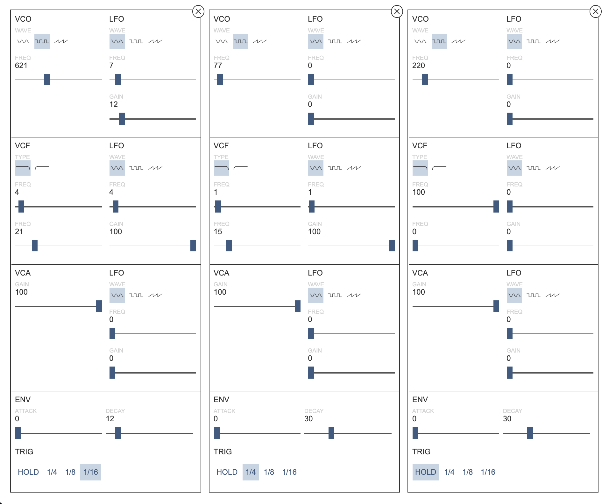

# Symbiotic Pulse System

 Symbiotic Pulse System is a virtually-controlled, analog modeled synthesizer for the web, developed on top of the Web Audio API. This project was oringally intended to be a synthesis learning tool for those who wish to learn about synthesis without having to purchase hardware. Like all DIY efforts, this is a work in progress - if you have any comments or suggestions, please reach out to contact@seanpierce.net.

 